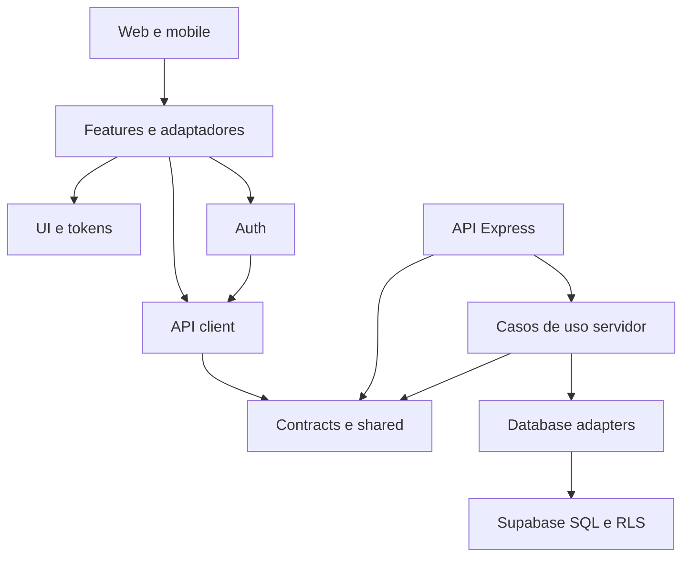

# Arquitetura vinculante — FGC MVP

Monólito modular com shells web/mobile, fachada HTTP e banco Supabase.
Define o destino; o código de demonstração ainda diverge. As definições estão
fechadas; provisionamento e comprovações em pendencias.md ainda precisam ser
executados. O status final deste contrato não significa aplicativo pronto.

## Invariantes

### AD-1 — Uma API de domínio

- **Binds:** CAP-1 a CAP-7, web/mobile/API.
- **Prevents:** clientes escolherem GraphQL, Data API e REST com regras diferentes.
- **Rule:** Express existente expõe REST `/api/v1`; contratos Zod/DTO compartilhados
  de contratos-tecnicos.md são a fonte de geração OpenAPI. Clientes não escrevem
  diretamente em tabelas. Substituir GraphQL demonstrativo ao migrar consumidores.

### AD-2 — Autoridade transacional

- **Binds:** CAP-2/CAP-3/CAP-5/CAP-7.
- **Prevents:** checagem somente na UI, duplicação concorrente e escrita após fechamento.
- **Rule:** comandos SQL verificam identidade/role/vínculo/estado, RLS e grants;
  versão esperada e idempotência por ator/operação. D62 nega admin em Judging;
  D68 impõe uma observação por ciclo/painel/equipe/autor. Fechamento e mutações
  compartilham lock de ciclo; nenhuma escrita operacional de Judging confirma
  depois de fechado. Purge e módulos independentes permanecem permitidos.

### AD-3 — Identidades separadas

- **Binds:** CAP-1/CAP-6, T02/T03/T05.
- **Prevents:** mentor herdar role staff ou cookies web virarem credenciais inseguras mobile.
- **Rule:** staff autentica no Supabase; access token em memória, refresh em cookie
  HttpOnly web ou SecureStore mobile. Mentor usa sessão opaca verificada em cada
  operação, vinculada à equipe no servidor. D70 restringe códigos ao admin.
  D71 fixa 7 dias por código e 7 dias por sessão, sem renovação silenciosa;
  regeneração revoga sessões anteriores e vínculos push. Remover autenticação
  de demonstração antes de dados reais.

### AD-4 — Donos e fronteiras

- **Binds:** T04 e todas as bibliotecas.
- **Prevents:** dois módulos alterarem os mesmos dados ou um bundle importar segredos.
- **Rule:** core governa equipes/roles; judging, filming e messaging governam seus
  dados; private governa sessões/entrega; audit só evidência permitida. Grafo T04
  proíbe feature→feature, cliente→servidor/database e biblioteca→app. Shell compõe
  features e adaptadores; contratos/shared não dependem de React nem de banco.

### AD-5 — Expo e ambientes de validação [ADOPTED]

- **Binds:** CAP-8, D67, E01–E06.
- **Prevents:** tratar Expo Go como produção ou atualizar mobile quebrando web.
- **Rule:** SDK57 estável como baseline técnica; atualizar React/RN/web em conjunto,
  preservar Nx e app web. CNG gera android/ios a partir de config/plugins versionados;
  pastas geradas não são fonte manual. Go cobre fluxos compatíveis; dev-client
  cobre push/links/sessão nativa; build assinada sem Metro cobre aceite final.
  Credenciais de desenvolvedor não são compartilhadas entre validadores.

### AD-6 — Pager e entrega desacoplados

- **Binds:** CAP-5/CAP-6.
- **Prevents:** polling ser confundido com push ou receipt com leitura.
- **Rule:** pager + outbox em transação; cron servidor reivindica entregas devidas,
  confere sessão/destinatário/ciclo e envia via adaptador Expo Push Service.
  Payload externo é genérico, sem conteúdo de Judging. Resposta mentor é única
  por pager/equipe; token inválido desativado; permissão negada preserva acesso no app.

### AD-7 — Ciclo e descarte [ADOPTED]

- **Binds:** CAP-7, D65.
- **Prevents:** ocultação ou exclusão de linhas ser apresentada como eliminação de cópias.
- **Rule:** duas confirmações, fechamento atômico, auditoria JA no prazo fixo;
  purge abrange Judging e cópias/mensagens relacionadas sem apagar outros módulos.
  Não usar dados reais enquanto backups/logs/caches não comprovarem o limite.
  D74 mantém o limite incluindo backups; D73 permite somente comprovante técnico
  mínimo por 30 dias, sem conteúdo, pessoas/equipes, contagens ou IDs de Judging.

### AD-8 — Ambiente, verificação e distribuição

- **Binds:** CAP-1 a CAP-8 e D51/D57.
- **Prevents:** dados reais em testes, segredo no bundle, preview confundido com entrega.
- **Rule:** dev/teste com dados sintéticos, produção separada; HTTPS e API sob a
  origem web por proxy. Segredos só no servidor. SMTP próprio e contas/dispositivos
  comprovados antes de validação externa. Unitários, integração/RLS e e2e aplicáveis
  via Nx antes de PR. Distribuição assinada até29/09 e publicação nas lojas exigidas;
  nenhum serviço pago contratado implicitamente.

## Convenções

UUID interno; identificador oficial como texto; timestamps UTC; envelope
data/meta ou error/requestId; paginação cursor; erro409 preserva rascunho;
nenhuma fila offline. Política HTTP/sessão/limites está em contratos-tecnicos.md.

## Base técnica verificada

Escolha de implementação, não instalação concluída: Expo57 estável com patch
mínimo57.0.23, RN0.86.3, React/React DOM19.2.3 e RN Web0.21.0; Node22 com mínimo
22.13 e patch de segurança vigente fixado no ambiente. Usar resolução oficial
Expo e lockfile para patches exatos. Nx22.6.0 instalado; alinhar plugins à mesma
linha compatível e validar build web antes de aceitar atualização.

Fontes: [SDK](https://docs.expo.dev/versions/latest/),
[changelog57](https://expo.dev/changelog/sdk-57),
[monorepo](https://docs.expo.dev/guides/monorepos/),
[CNG](https://docs.expo.dev/workflow/continuous-native-generation/).

## Capacidades

| Capacidade | Dono | Regras |
| --- | --- | --- |
| CAP-1 acesso | Auth/API/private/core | AD-1/AD-2/AD-3/AD-8 |
| CAP-2 equipes | Admin/imports/core | AD-1/AD-2/AD-4 |
| CAP-3 Judging | Judging | AD-1/AD-2/AD-4/AD-7 |
| CAP-4 programação | Schedule | AD-1/AD-4; placeholder D61 |
| CAP-5 Filming | Filming/mentor | AD-1/AD-2/AD-4/AD-6 |
| CAP-6 alertas | Messaging/notifications | AD-3/AD-6 |
| CAP-7 encerramento | Judging/rotina de purge | AD-2/AD-7 |
| CAP-8 distribuição | Shells/infraestrutura | AD-5/AD-8 |

## Dependências que não são decisões técnicas em aberto

Valores de contas, domínios, bundle IDs e host são provisionamento da organização;
precisam constar na configuração antes dos builds. Amostra confirma o formato
oficial antes de carga real. Nenhum desses valores é inventado ou requisito
marcado como testado. D71–D74 resolvem P17/P18/P19: operação começa limpa, sessão
tem prazo/revogação definidos e comprovante tem retenção restrita. Viabilidade
de D65/D74 continua exigindo evidência; até lá, implementar/testar com dados sintéticos.
